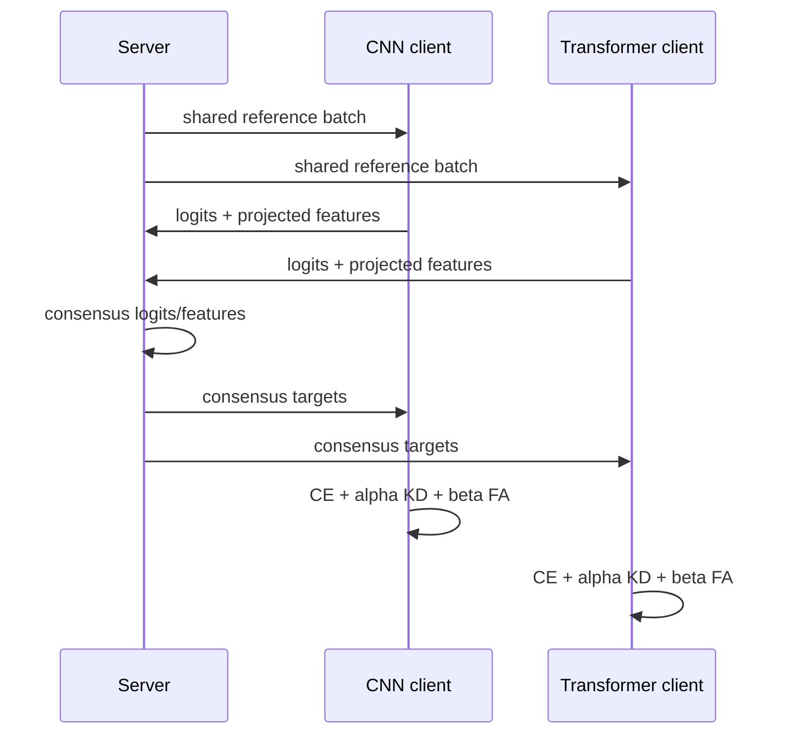

# Adaptive KD+FA：异构联邦知识迁移

## 1. 问题定义

FedAvg 要求客户端参数空间同构。当 CNN、ResNet 和 Transformer 并存时，参数无法逐元素平均。KD+FA 交换公共参考输入上的 logits 和投影到共享维度的 features，从功能空间而非参数空间进行知识迁移。

## 2. 目标函数

$$\mathcal L_k=\mathcal L_{CE}+\alpha_t\mathcal L_{KD}+\beta_t\mathcal L_{FA}.$$

当前 `kd_loss` 实现温度缩放的交叉熵：

$$\mathcal L_{KD}=T^2H(\operatorname{softmax}(z_{teacher}/T),\operatorname{softmax}(z_{student}/T)).$$

特征对齐要求各客户端先使用投影头 $g_k$ 得到同形状表示：

$$\bar h=\frac1K\sum_k g_k(h_k),\quad
\mathcal L_{FA}=\frac1K\sum_k\|g_k(h_k)-\bar h\|_2^2.$$

`Schedule.at(t)` 返回 $α_t=α_0γ^t,β_t=β_0γ^t$。现有历史实验未支持“指数衰减显著提升”，因此该调度仅是可检验选项，不是已证实贡献。

## 3. 通信分析

若参考集大小为 $R$，类别数 $C$，共享特征维度 $D$，float32 上行大小约：

$$B_{KDFA}=4R(C+D)\ \text{bytes/client/round}.$$

`communication_bytes` 使用 NumPy 实际 `nbytes`。与 FedAvg 比较时必须统一统计上行/下行、数据类型、协议开销与是否包含投影头；否则“55×”不可直接比较。

## 4. 实验协议

| 维度 | 建议 |
|---|---|
| 架构 | 至少 3 种异构骨干 |
| 数据 | MNIST + CIFAR-10，后续加 PathMNIST |
| Non-IID | Dirichlet $α=0.1,0.5$ |
| 基线 | Local, FedAvg(同构参考), FedMD, FedProto, FedPer |
| 消融 | KD-only, FA-only, KD+FA, schedule |
| 重复 | ≥3 seeds，报告 mean±std/CI |
| 指标 | Accuracy, macro-F1, convergence round, bytes-to-target |

关键公平性约束：各方法使用相同本地 epoch、优化器预算、客户端采样率与调参预算。FedAvg 只能在同构设置中作参考，不应伪装成可直接处理异构模型的竞争者。

## 5. 已知局限

- 当前公开包未包含 PyTorch 本地训练循环、投影头网络和服务器编排。
- 固定参考批次可被过拟合，且可能不满足“无公共数据”的严格定义。
- logits/features 本身也可泄露信息，需评估成员推断与表示反演。
- FA 性能取决于投影头容量、稳定性和语义对齐。

## 6. 论文图表建议

1. 框架图：异构客户端与共享参考路径。
2. Pareto 图：Accuracy 对总通信字节。
3. 收敛图：各方法 mean±std 随轮数变化。
4. 消融表：CE/KD/FA/调度的增量效果。
5. 异质性热图：数据 $α$ × 架构组合。
6. 通信表：上行、下行、每轮、达到目标精度的总量。
