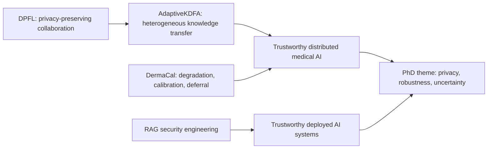

# CV 研究论文综合评估

## 评估范围与版本

| 项目 | 评估主版本 | 性质 |
|---|---|---|
| DPFL / PrivBreast-FL | `CSC8209_NingYang_Dissertation.pdf` | 36 页硕士毕业论文 |
| DermaCal | `Paper_Draft_DermaCal.md/.pdf`, 2026-07-16 | 15 页中文主稿 |
| AdaptiveKDFA | `Paper_AdaptiveKDFA_v2.tex/.pdf`, 2026-07-13 | 6 页英文稿 |
| DistributedOpt | `Paper_Draft_DistributedOpt.md` | 早期演化稿 |

本评估是内部审稿式评估，不是正式 peer review，也未独立重跑原论文的全部实验。评分采用 1–5 级：1=严重不足，3=可用但需大修，5=接近成熟投稿。

## 综合评分

| 维度 | DPFL | DermaCal | AdaptiveKDFA |
|---|---:|---:|---:|
| 问题价值 | 4 | 5 | 4 |
| 创新/研究定位 | 2 | 3 | 3 |
| 方法正确性 | 2 | 3 | 4 |
| 实验充分性 | 2 | 3 | 3 |
| 统计严谨性 | 1 | 2 | 2 |
| 论证与结论一致性 | 2 | 4 | 5 |
| 可复现性 | 2 | 3 | 4 |
| 写作与呈现 | 2 | 4 | 4 |
| **当前判断** | 历史学位成果；不建议原样投稿 | 有潜力；大修后再投 | 可形成 workshop/短文；需增强统计与规模 |

## 组合研究叙事

最强的 PhD 叙事不是“所有方法都达到 SOTA”，而是研究轨迹从隐私保护、异构协作扩展到部署可靠性，且后期工作开始主动报告零结果和局限。

## 投稿优先级

1. **DermaCal**：研究问题最接近完整论文，但需多种子、统计检验、外部数据与质量指标验证。
2. **AdaptiveKDFA**：论证诚实且主线清晰，可先作 workshop/负结果短文；完整会议稿需更强异构性与更多数据。
3. **DPFL**：作为学位论文和研究起点保留；若重做应从威胁模型、DP 会计和无泄漏实验管线重建，而非局部修文。
4. **DistributedOpt**：不单独投稿，并入 AdaptiveKDFA 的历史/理论素材库。

详细评估已写入各项目 `docs/paper-assessment.md`。
