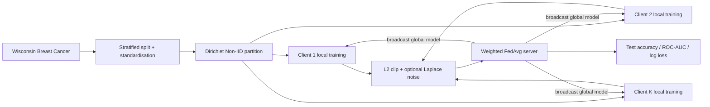

# DPFL Medical AI：系统与方法全览

## 1. 研究问题

医疗机构之间无法直接共享原始样本，而单一机构往往数据不足。联邦学习通过交换模型更新而非原始数据缓解数据孤岛，但更新仍可能泄露成员信息。本项目实现一个可复现的 Laplace DP-FedAvg 教学/研究框架，用于分析协作效用与隐私扰动的权衡。

## 2. 系统架构



| 模块 | 实现 | 输入 | 输出 |
|---|---|---|---|
| 数据 | `load_data` | sklearn 数据集 | 标准化 train/test |
| 异质划分 | `partition_non_iid` | 标签、α、客户端数 | 客户端本地数据 |
| 本地学习 | `train_local` | 全局模型、本地数据 | 本地逻辑回归模型 |
| 隐私机制 | `privatize_update` | 更新向量、C、ε | 裁剪/加噪更新 |
| 聚合 | `aggregate` | 客户端模型与样本量 | 新全局模型 |

## 3. 核心方法

FedAvg 按本地样本数加权：

$$w_{t+1}=w_t+\sum_{k=1}^{K}\frac{n_k}{\sum_jn_j}\widetilde{\Delta w}_{t,k}.$$

客户端更新先裁剪：

$$\bar\Delta=\Delta\cdot\min\left(1,\frac{C}{\|\Delta\|_2}\right),$$

再逐维注入 Laplace 噪声：

$$\widetilde\Delta=\bar\Delta+\operatorname{Lap}(0,C/\varepsilon).$$

当 `epsilon=None` 时，仅裁剪不加噪，用作非隐私对照。当前代码中 `epsilon` 是每轮参数；依次组合的粗略上界为 $T\varepsilon$。这不是 RDP/PRV 会计器，不应解读为生产级隐私保证。

## 4. 复现与实验设计

```bash
pip install -e ".[dev]"
dpfl --rounds 20 --clients 5 --epsilon 5 --seed 42
dpfl --rounds 20 --clients 5 --no-dp --seed 42
```

建议实验矩阵：

| 因子 | 建议取值 | 目的 |
|---|---|---|
| $ε$ | 0.5, 1, 2, 5, 10, ∞ | 隐私-效用曲线 |
| $α_{Dir}$ | 0.1, 0.5, 1, 10 | 统计异质性 |
| 客户端数 | 3, 5, 10 | 聚合规模 |
| 裁剪 C | 0.1, 0.5, 1, 2 | 偏差-方差权衡 |
| 随机种子 | ≥5 个 | 统计稳定性 |

主指标应报告 Accuracy、ROC-AUC、Log Loss 的均值±标准差，并同时列出孤岛训练、非私有 FedAvg 和 DP-FedAvg。

## 5. 复杂度与工程边界

- 每轮计算约 $O(KEnd)$，$K$ 为客户端数，$E$ 为本地 epoch，$n$ 为总样本数，$d$ 为特征数。
- 每轮上行通信约 $K(d+1)$ 个标量。
- 当前是单进程模拟，不包含 TLS、安全聚合、客户端身份、掉线恢复和恶意客户端鲁棒性。
- sklearn 数据是公开教学数据，不代表多中心临床外部验证。

## 6. 论文写作参考

建议结构：Introduction → Related Work → Threat Model → Method → Privacy Analysis → Experiments → Limitations。

建议图表：

1. 图 1：上述联邦数据流与信任边界。
2. 图 2：Accuracy/ROC-AUC 对 $ε$ 的隐私-效用曲线。
3. 图 3：不同 Dirichlet $α$ 下的收敛曲线。
4. 表 1：数据划分与超参数。
5. 表 2：Isolated/FedAvg/DP-FedAvg 多种子结果。
6. 表 3：隐私威胁、防护措施和剩余风险。

不应在未完成的情况下声称：已防御梯度反演/成员推断、已达到 $(ε,δ)$-DP、或已复现 CV 的历史精度提升。
