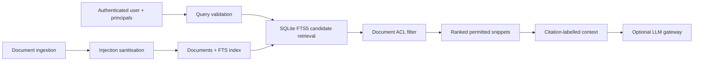
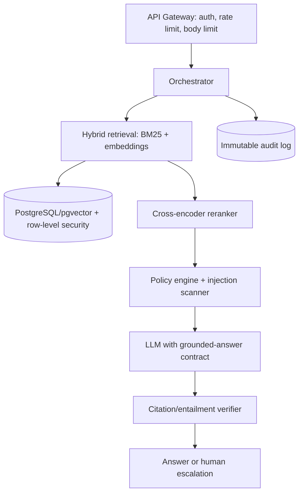

# 安全、可引用的自助服务 RAG

## 1. 系统目标

内部知识助手的关键问题不是“能否生成回答”，而是“是否只检索当前身份可见的信息，能否指出依据，并抵御文档内嵌指令”。当前实现专注于 LLM 之前的可确定检索层。

## 2. 当前代码保证

| 能力 | 实现 | 边界 |
|---|---|---|
| 索引 | SQLite FTS5/BM25 | 词法检索，非向量语义检索 |
| 权限 | 检索后、构造上下文前 ACL 过滤 | 原型 ACL 为逗号字符串 |
| 引用 | `[source:document_id]` | 证明来源，不证明回答必然正确 |
| 注入防护 | 入库时拦截部分模式 | 不是完整内容安全系统 |
| 更新 | 文档表与 FTS 索引交易更新 | 暂无版本历史 |

安全不变式：未授权文档不得进入 `context()` 返回值。测试直接验证该边界，而非依赖 LLM “不要泄露”的提示词。

## 3. 上线级扩展架构

不应只用应用层 ACL：生产数据库应使用 row-level security，并将租户/用户身份传到查询层。候选集过大后再在 Python 过滤会同时带来侧信道与可用性问题。

## 4. 评估协议

| 层级 | 指标 |
|---|---|
| 检索 | Recall@k, Precision@k, MRR, nDCG@k |
| 生成 | answer correctness, faithfulness, citation precision/recall |
| 安全 | ACL leakage rate, injection attack success rate, sensitive-span exposure |
| 路由 | auto-resolution precision, escalation recall |
| 系统 | P50/P95 latency, error rate, cost/query, index freshness |

评估数据应将 query–relevant document–permitted principals–expected action 一起标注。安全集要包含：未授权直接查询、语义改写、文档内注入、跨租户同名文档、删除文档残留索引。

## 5. 威胁模型

| 威胁 | 当前措施 | 生产补充 |
|---|---|---|
| 未授权检索 | 应用层 ACL | RLS + 身份签名 |
| 间接 Prompt Injection | 基础模式拦截 | 结构化上下文、策略模型、工具权限隔离 |
| 索引中毒 | 无 | 发布审批、来源签名、版本化 |
| 敏感日志 | 无日志 | 字段级脱敏、保留策略 |
| 资源滥用 | query/limit 有限约束 | 网关限流、超时、预算 |

## 6. 论文/技术报告图表

1. 信任边界与数据流图。
2. BM25/vector/hybrid/reranker 的检索消融表。
3. Recall@k–latency Pareto 曲线。
4. ACL 攻击矩阵与泄漏率。
5. Injection 攻击类别×防护层的消融。
6. 路由混淆矩阵：Q&A / ticket action / escalation。

如写研究论文，建议将主问题聚焦为“权限感知 RAG 的端到端泄漏评估”，而非泛化的“做了一个 RAG 系统”。
