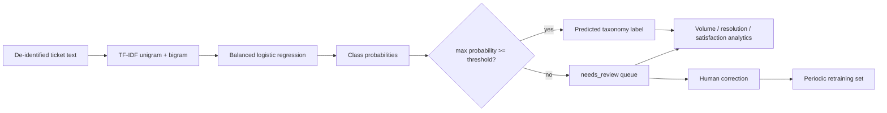

# 层次化工单分类与运营分析

## 1. 任务定义

给定工单标题与描述 $x$，预测严格体系中的类别 $y$，并在不确定时转人工复核。当前实现是 TF-IDF n-gram + class-balanced Logistic Regression，而不是 LLM 分类器。

## 2. 特征与模型

TF-IDF 权重可写为：

$$\operatorname{tfidf}(t,d)=\operatorname{tf}(t,d)\log\frac{N+1}{\operatorname{df}(t)+1}.$$

多类 Logistic Regression 估计 $p(y=c\mid x)$。`class_weight="balanced"` 按类频率的反比调整训练损失。当

$$\max_c p(y=c\mid x)<\tau$$

时输出 `needs_review`，但保留 `suggested_category` 供人工参考。注意：Logistic Regression 的 `predict_proba` 不必然完美校准，阈值上线前应使用独立校准集并测试 reliability diagram/ECE。

## 3. 数据和分类体系治理

| 问题 | 严谨做法 |
|---|---|
| 时间泄漏 | 按时间切分 train/validation/test |
| 重复工单 | 在切分前去重/按事件分组 |
| 类别改名 | 体系版本化和标签迁移表 |
| 少数类 | macro-F1、per-class recall，不只看 accuracy |
| 个人/秘密信息 | 训练前脱敏，限制原文访问 |
| 标注噪声 | 双人抽样、冲突仲裁、一致性指标 |

若体系为 `domain.category.issue`，建议比较 flat classifier 和 hierarchical classifier。层次评估应同时报告顶层、叶子层以及树距离损失。

## 4. 评估与阈值选择

| 指标 | 用途 |
|---|---|
| macro/weighted F1 | 整体分类，关注少数类 |
| per-class recall | 关键类别漏分析 |
| top-k accuracy | 人工辅助候选列表 |
| coverage | 自动分类占比 |
| selective risk | 自动接受样本错误率 |
| ECE/Brier | 概率可靠性 |
| analyst time saved | 真实流程效用 |

阈值 $τ$ 不应为了提高自动化率直接调低。建议在 validation set 上满足“自动分类 precision ≥ 业务目标”后最大化 coverage，并在独立 test set 报告。

## 5. 分析层边界

`summarize` 计算工单数、类别分布、平均解决时间和平均满意度。生产报表还应增加：

- median/P90/P95 resolution time，避免均值受长尾支配；
- SLA breach rate 和删失原因；
- 模型版本、体系版本和人工修正率；
- 按时间/团队/渠道分层，同时执行最小样本量隐私门槛。

## 6. 论文/技术报告图表

1. 数据→分类→复核→回流的闭环架构。
2. 体系树与各叶子样本数。
3. 基线表：规则、TF-IDF+LR、轻量 Transformer、LLM few-shot。
4. Precision–coverage/risk–coverage 曲线。
5. 混淆矩阵及高代价错误分析。
6. 时间切片性能与数据漂移。
7. 人工修正前后的效率与质量对比。

如写论文，有价值的研究问题应聚焦在层次体系、低资源类别、选择性预测或时间漂移，而非只报告一个总体 accuracy。
